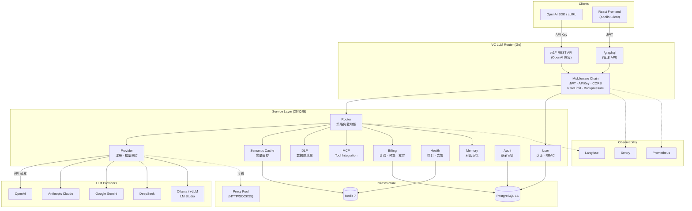
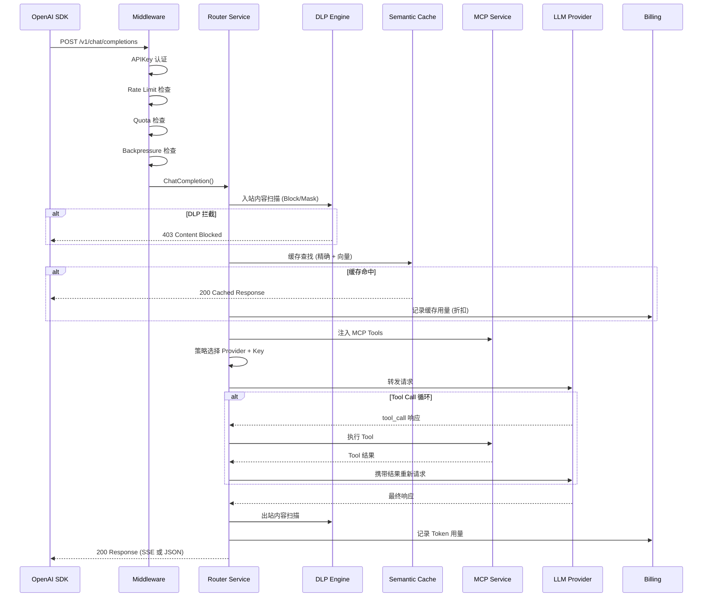
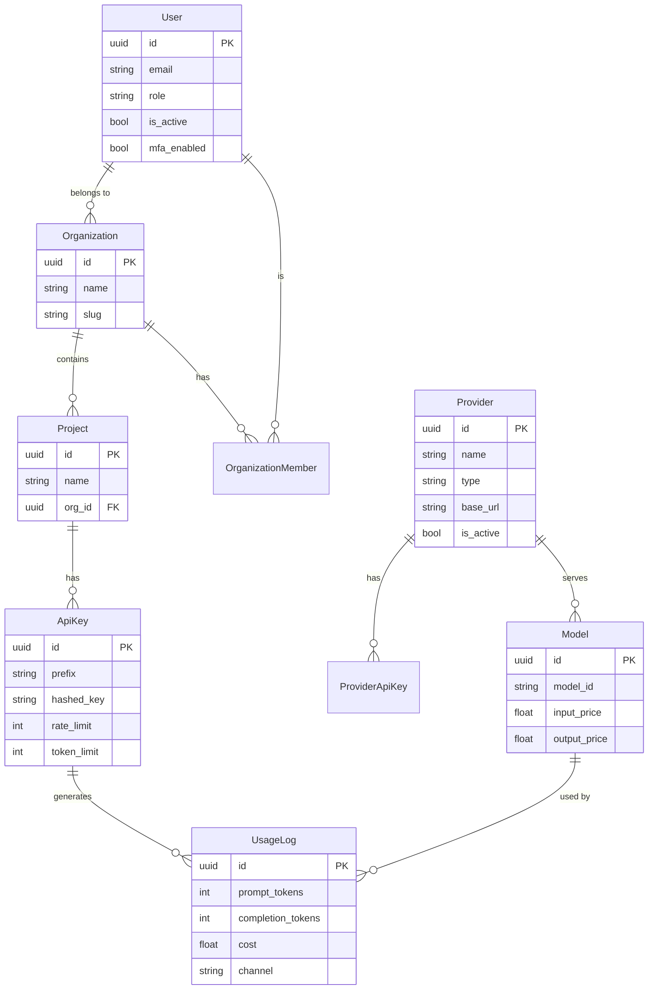

# 系统架构

## 总体架构



## 请求生命周期



## 数据模型概览



## 分层架构

```
┌─────────────────────────────────────────────────────────┐
│                    Transport Layer                        │
│  /v1/* (REST, OpenAI-Compatible)  │  /graphql (GQL)      │
├───────────────────────────────────┼──────────────────────┤
│             Middleware Chain                               │
│  RequestID → Metrics → Security → CORS → Logging → Panic │
├───────────────────────────────────────────────────────────┤
│                    Handler Layer                           │
│  REST Handlers (LLM)  │  GraphQL Resolvers (Management)   │
├───────────────────────────────────────────────────────────┤
│                    Service Layer (26 modules)              │
│  router · billing · provider · cache · dlp · mcp · ...    │
├───────────────────────────────────────────────────────────┤
│                    Repository Layer                        │
│  GORM-based data access with interface abstraction         │
├───────────────────────────────────────────────────────────┤
│                    Infrastructure                          │
│  PostgreSQL 16  │  Redis 7  │  External APIs               │
└─────────────────────────────────────────────────────────┘
```

## 弹性机制

| 机制 | 说明 |
|------|------|
| **Circuit Breaking** | Provider 连续 5 次 5xx/超时 → 自动熔断剔除 |
| **API Key 轮转** | 429/Quota 错误 → 自动切换备用 Key 重试 |
| **背压保护** | DB 连接池 ≥80% → 返回 503 拒绝新请求 |
| **Redis 降级** | Redis 不可用 → Rate Limit 禁用，Cache 跳过 |
| **Context 取消** | 流式请求客户端断开 → 后台 goroutine 严格取消 |
| **预录计费** | 请求发起即记录 → 断连也能审计部分消耗 |
