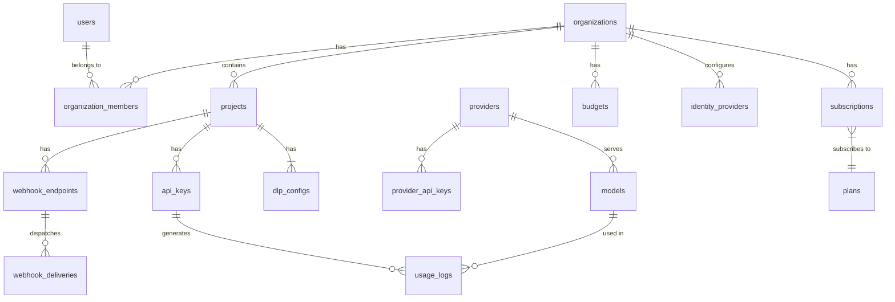

# 数据库 Schema 参考

> 使用 PostgreSQL 16 + GORM ORM。所有主键为 UUID，时间戳自动管理。

## ER 关系图



## 核心表

### Identity & Access

| 表 | 说明 | 关键字段 |
|----|------|---------|
| `users` | 平台用户 | `email`, `role`, `is_active`, `balance`, `mfa_enabled` |
| `organizations` | 组织 (计费单元) | `name`, `owner_id`, `billing_limit` |
| `organization_members` | 组织成员映射 | `org_id` + `user_id` (复合主键), `role` |
| `projects` | 工作区 | `org_id`, `name`, `quota_limit`, `white_listed_ips` |
| `api_keys` | API 密钥 | `project_id`, `key_hash`, `rate_limit`, `token_limit`, `channel` |
| `invite_codes` | 邀请码 | `code`, `max_uses`, `use_count`, `expires_at` |
| `identity_providers` | 企业 SSO 配置 | `org_id`, `type` (oidc/saml), `domains`, OIDC/SAML 字段 |
| `audit_logs` | 安全审计 | `action`, `actor_id`, `target_id`, `ip`, `signature` |

### Provider & Models

| 表 | 说明 | 关键字段 |
|----|------|---------|
| `providers` | LLM 供应商 | `name`, `base_url`, `priority`, `weight`, `model_patterns` |
| `models` | 模型定义 | `provider_id`, `name`, `input_price_per_1k`, `output_price_per_1k` |
| `provider_api_keys` | 供应商 API Key (加密) | `provider_id`, `encrypted_api_key`, `priority`, `weight` |
| `proxies` | HTTP/SOCKS5 代理 | `url`, `type`, `is_active` |

### Billing & Usage

| 表 | 说明 | 关键字段 |
|----|------|---------|
| `plans` | 订阅套餐 | `name`, `price_month`, `token_limit`, `rate_limit` |
| `subscriptions` | 组织订阅 | `org_id`, `plan_id`, `status`, `stripe_subscription_id` |
| `orders` | 支付订单 | `org_id`, `order_no`, `amount`, `payment_method`, `status` |
| `transactions` | 余额变动记录 | `org_id`, `type` (recharge/deduction/refund), `amount`, `balance` |
| `usage_logs` | API 调用记录 | `project_id`, `model_name`, `request_tokens`, `response_tokens`, `cost`, `channel` |
| `budgets` | 预算限额 | `org_id`, `monthly_limit_usd`, `alert_threshold`, `enforce_hard_limit` |

### Content & Configuration

| 表 | 说明 | 关键字段 |
|----|------|---------|
| `dlp_configs` | DLP 设置 | `project_id`, `strategy`, `mask_emails`, `custom_regex` |
| `system_configs` | 系统配置键值对 | `key`, `value`, `category` |
| `mcp_servers` | MCP 服务器 | `name`, `transport`, `command`/`url`, `status` |
| `routing_rules` | 路由规则 | `name`, `conditions`, `target_provider_id`, `priority` |
| `prompt_templates` | Prompt 模板 | `name`, `content`, `active_version_id` |
| `announcements` | 平台公告 | `title`, `content`, `is_active`, `starts_at`, `ends_at` |
| `documents` | 文档页 | `title`, `content` (Markdown), `slug`, `is_published` |
| `coupons` | 优惠码 | `code`, `discount_type`, `discount_value`, `max_uses` |
| `redeem_codes` | 兑换码 | `code`, `credits`, `status` |

### Webhook & Tasks

| 表 | 说明 | 关键字段 |
|----|------|---------|
| `webhook_endpoints` | Webhook 目标 | `project_id`, `url`, `secret` (HMAC), `events` (JSONB) |
| `webhook_deliveries` | 投递记录 | `endpoint_id`, `event_type`, `status`, `retry_count` |
| `tasks` | 异步任务 | `type`, `status`, `progress`, `result` |

### Health & Monitoring

| 表 | 说明 | 关键字段 |
|----|------|---------|
| `health_records` | 健康检查记录 | `target_type`, `target_id`, `status`, `latency` |
| `alerts` | 告警 | `type`, `severity`, `status`, `target_id` |
| `error_logs` | 错误日志 | `level`, `message`, `stack_trace` |
| `notification_channels` | 通知渠道 | `type` (email/webhook/wework/dingtalk), `config` |

## 迁移管理

| 模式 | 行为 |
|------|------|
| 开发/调试 | GORM `AutoMigrate` 自动建表 (需开启 `AutoMigrate` Feature Gate) |
| 生产 | `go run cmd/migrate/main.go up` 执行版本化 SQL 迁移 |

```bash
make migrate-up       # 执行迁移
make migrate-down     # 回滚上一版本
make migrate-status   # 查看当前版本
make check-schema     # 对比 GORM 模型与 SQL 迁移一致性 (需 Docker)
```
