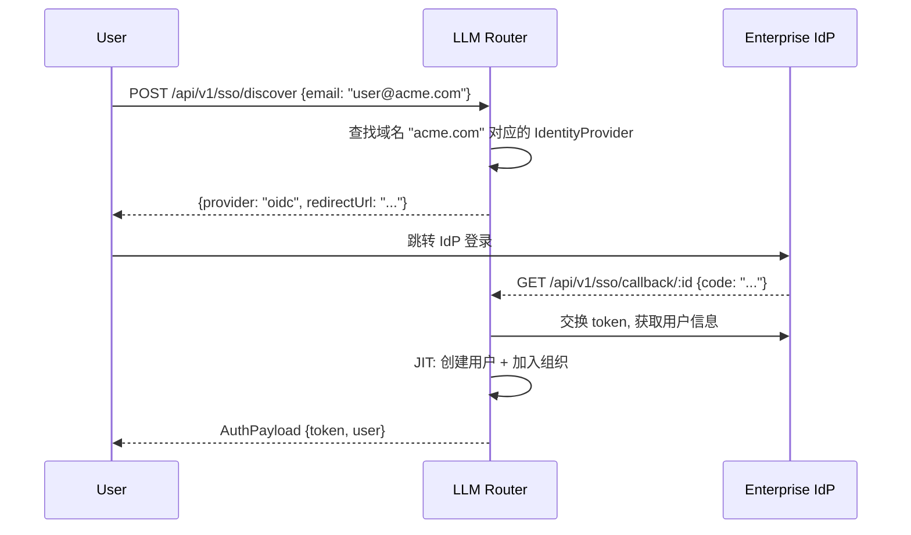

# SSO 企业集成指南

LLM Router 支持两层 SSO:

1. **平台级 OAuth2** — Google / GitHub 社交登录 (全局配置)
2. **组织级 Identity Provider** — OIDC/SAML 企业 SSO (按组织配置)

---

## 平台级 OAuth2 (Google / GitHub)

通过环境变量或管理后台 **Settings → OAuth2** 配置。

### GitHub

1. 在 [GitHub Developer Settings](https://github.com/settings/developers) 创建 OAuth App
2. **Authorization callback URL**: `https://your-domain.com/auth/oauth2/github/callback`
3. 配置环境变量:

```bash
GITHUB_CLIENT_ID=your-client-id
GITHUB_CLIENT_SECRET=your-client-secret
```

### Google

1. 在 [Google Cloud Console](https://console.cloud.google.com/apis/credentials) 创建 OAuth 2.0 Client
2. **Authorized redirect URI**: `https://your-domain.com/auth/oauth2/google/callback`
3. 配置环境变量:

```bash
GOOGLE_CLIENT_ID=your-client-id.apps.googleusercontent.com
GOOGLE_CLIENT_SECRET=your-secret
```

### 启用/禁用

通过管理后台 Settings → OAuth2 可动态启用/禁用各 Provider，无需重启。

---

## 组织级 Identity Provider (OIDC/SAML)

每个组织可配置独立的企业 IdP，实现基于邮箱域名的自动发现和 JIT (Just-In-Time) 成员分配。

### 添加 OIDC Provider

通过管理后台 **Organization → Identity Providers → Add** 或 GraphQL:

```graphql
mutation {
  createIdentityProvider(input: {
    orgId: "org-uuid"
    type: "oidc"
    name: "Okta"
    domains: "acme.com,corp.acme.com"
    oidcClientId: "0oa1234..."
    oidcClientSecret: "secret..."
    oidcIssuerUrl: "https://acme.okta.com/oauth2/default"
    enableJit: true
    defaultRole: "MEMBER"
  }) { id name isActive }
}
```

### OIDC 配置参数

| 字段 | 说明 |
|------|------|
| `type` | `oidc` |
| `name` | 显示名称 (e.g., "Okta", "Azure AD") |
| `domains` | 邮箱域名，逗号分隔 (用于租户发现) |
| `oidcClientId` | OIDC Client ID |
| `oidcClientSecret` | OIDC Client Secret |
| `oidcIssuerUrl` | Issuer URL (用于 `.well-known/openid-configuration`) |
| `enableJit` | 启用 JIT 自动创建用户并加入组织 |
| `defaultRole` | JIT 新成员默认角色 (`OWNER` / `ADMIN` / `MEMBER` / `READONLY`) |
| `groupRoleMapping` | JSON 映射 IdP Group → 系统角色 |

### SAML 配置参数

| 字段 | 说明 |
|------|------|
| `type` | `saml` |
| `samlEntityId` | SP Entity ID |
| `samlSsoUrl` | IdP SSO URL |
| `samlIdpCert` | IdP 签名证书 (PEM) |

### 租户发现流程



### Group-to-Role 映射

通过 `groupRoleMapping` 字段将 IdP 的 group claim 自动映射为系统角色:

```json
{
  "engineering": "ADMIN",
  "contractors": "READONLY",
  "devops": "MEMBER"
}
```
